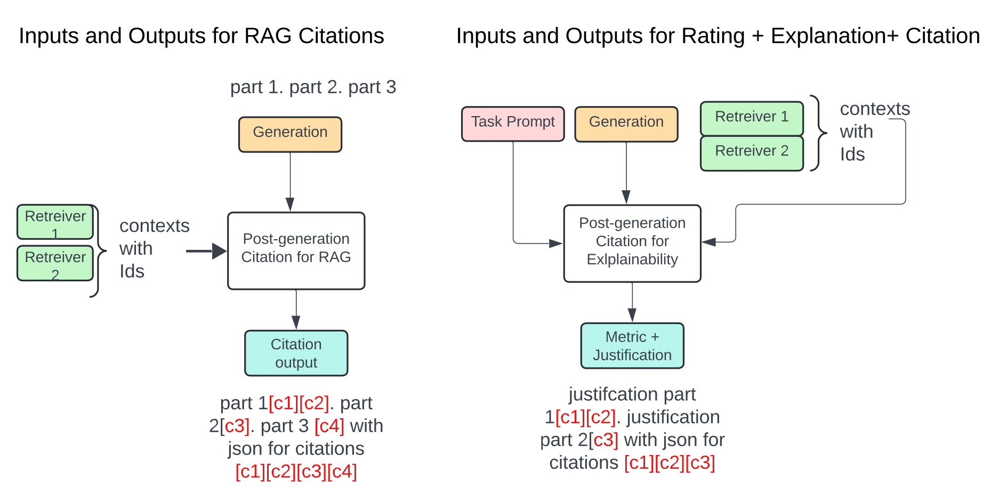
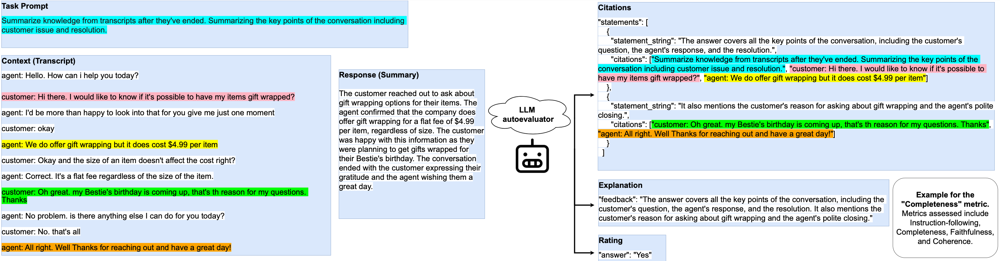

# Rate, Explain and Cite (REC): Enhanced Explanation and Attribution in Automatic Evaluation by Large Language Models

This repository contains the code and data for paper [**R**ate, **E**xplain and **C**ite (REC): Enhanced Explanation and Attribution in Automatic Evaluation by Large Language Models]().
In this paper, we introduced (1) a curated dataset, REC-Data, for citations and explanations generation fine-tuning, which is the first public dataset containing both content quality citations and RAG citations. (2) A novel general-purpose LLM autoevaluator that comes in two sizes: 12B and 70B, that can generate better quality Rating, Explanation and Citations (REC), with little to no trade-off in general instruction task performance evaluated on various public benchmark datasets, including RewardBench, LLM-AggreFact, and CoBBLEr.

## RAG citations vs Content quality citations

## Illustration of task prompt, context, response, and model outputs of Rating, Explanation, and Citations(REC). Here we use summarization evaluation as an example.

## Rec-Data
Our curated citations and explanation fine-tuning data is provided as `REC_data.zip`, which contains 24,081 (prompt, completion) pairs. Note that the full training data of REC-12B and REC-70B additionally included [HelpSteer2](https://huggingface.co/datasets/nvidia/HelpSteer2), [Skywork](https://huggingface.co/datasets/Skywork/Skywork-Reward-Preference-80K-v0.1), [OffsetBias](https://huggingface.co/datasets/NCSOFT/offsetbias), and [Code Preference](https://huggingface.co/datasets/Vezora/Code-Preference-Pairs). The additional data can be downloaded at their own websites.

## Model training

